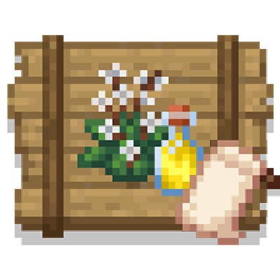

## RusticDelight: Refabricated
  

  

## 介绍：
**RusticDelight: Refabricated** 是农夫乐事模组的附属，添加了新的作物，方块，物品。  

## 特性：
本模组的特性将与官方版本保持一致。

## FAQ：
Q: 什么是 RusticDelight: Refabricated？  
A: RusticDelight: Refabricated 是 RusticDelight 的 Fabric 非官方移植版。

Q: RusticDelight: Refabricated 能否做到与官方版本的更新进度保持一致？  
A: 我们尽力与官方版本的更新进度保持一致。

Q: 如果我的模组崩溃了我该向谁反馈？  
A: 如果是本模组崩溃了请向本模组的仓库发送Issue。如果是官方版模组崩溃了请不要给本模组发送Issue。

## 反馈：
你可以向本仓库发送一个 [issues](https://github.com/ShangguanXi/RusticDelight-Refabricated/issues) 。